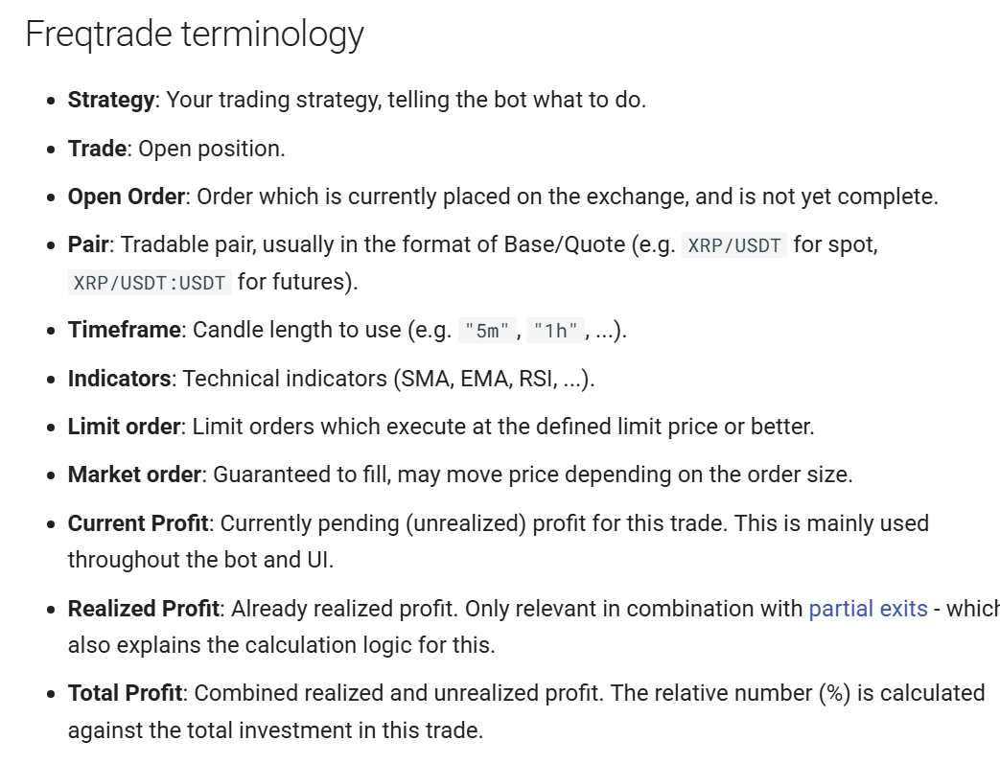
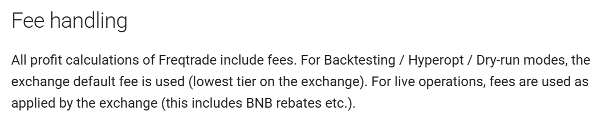
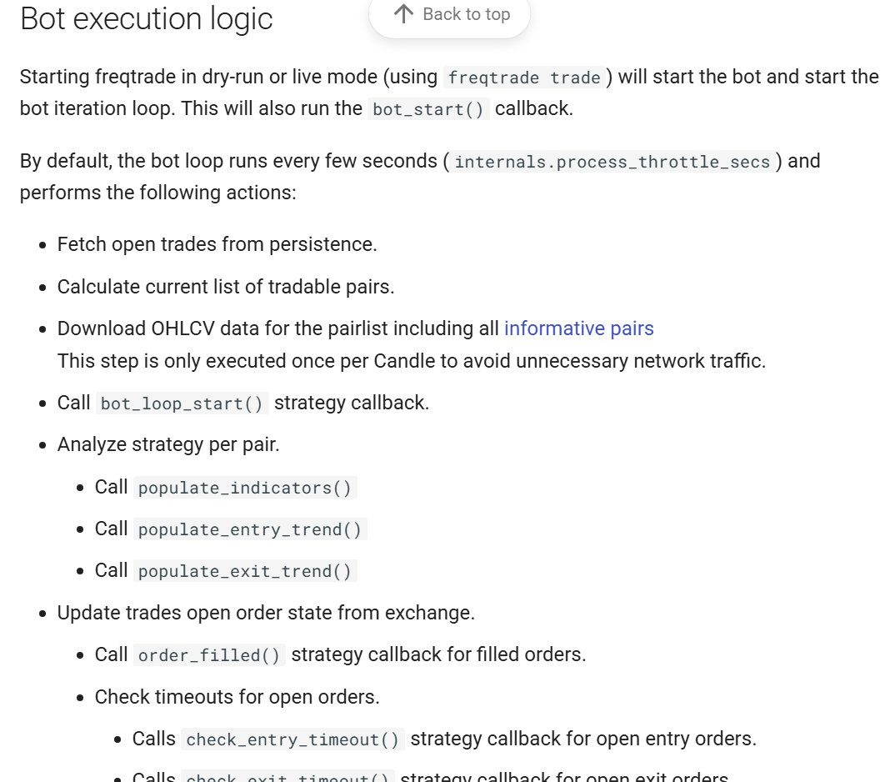

# Initial Analysis

## Background
Having done a small investment into crypto currencys, and it being a volatile market, I am keen to explore algo trading and trial this to see if any passive income can be generated from it. 

The one project that stands out is - https://www.freqtrade.io/en/stable/

It has an Open-source code base and seems well regarded with good documentation. Even if the project proves to not generate passive income, it will be a learning experience to understand how it codes. 

## First Goal

- To execute a dry run of a strategy
- Sub tasks:
  - Understand code base and required information to do a strategy
  - Run the code base locally
  - Deploy the code base and run analysis

## Analysis

### Key Links

- Website - https://www.freqtrade.io/en/stable/
- Github code base - https://github.com/freqtrade/freqtrade

### Initial Discovery

**Key Terminology**

Link - https://www.freqtrade.io/en/stable/bot-basics/#freqtrade-terminology

**Fee Handling**

Binance - from a quick google charges between 0.10% and 0.03%, so each trade needs to make atleast this x 2 for profit to accumulate

**Other Notes**

Applying the strategy rules, linked to candle criteria will be important to understand. This drives the trading rules

The bot execution logic section, contains the key functions to follow

### Initial Plan

1. Follow the quickstart page - https://www.freqtrade.io/en/stable/docker_quickstart/#docker-quick-start
2. Run a dry run with the example strategy (SampleStrategy) that is provided out the box
3. Create a bespoke strategy and trial run

If I do the above, then I can execute it. It's about then finding a strategy that I can test, with suitable risk criteria for losses.
